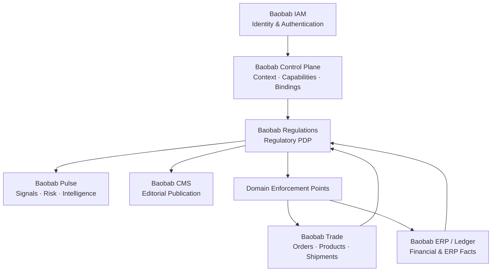
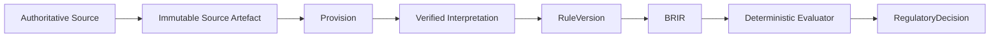
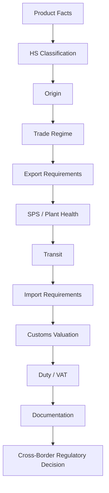

# baobab-regulations

> **Headless, jurisdiction-aware regulatory intelligence and deterministic regulatory decision engine for the Baobab Platform.**

**Repository:** `baobab-platform/baobab-regulations`  
**Status:** Architecture established; domain/application scaffold active; canonical capability provider support not yet declared  
**Architecture:** [`docs/adr/`](docs/adr/) — ADR-REG-0001 through ADR-REG-0031  
**License:** Apache License 2.0

---

## What is Baobab Regulations?

`baobab-regulations` is the Baobab Platform engine responsible for turning regulatory sources into **traceable, temporally correct, context-aware and machine-executable regulatory decisions**.

It is designed to answer questions such as:

> Can this exact transaction, by this legal entity, involving this product, between these jurisdictions, at this point in legal time, proceed — and if not, what regulatory requirement is missing, why does it apply, and which authoritative sources support that conclusion?

Baobab Regulations is not intended to be a legal-document search engine, generic policy engine, compliance monolith or AI chatbot.

Its core responsibility is the governed chain:

```text
Regulatory Source
      ↓
Source Artefact
      ↓
Provision
      ↓
Interpretation
      ↓
Regulatory Rule
      ↓
Applicability
      ↓
Obligation / Permission / Prohibition
      ↓
Requirement
      ↓
Evidence Assessment
      ↓
Regulatory Decision
      ↓
Operational Enforcement elsewhere
```

The engine is **normative**: it reasons about what is required, permitted, prohibited or unresolved.

That distinguishes it from `baobab-pulse`, whose role is primarily intelligence about what is happening, what may happen, and what risks or opportunities may follow.

---

## Current repository status

The repository contains the original **30-ADR foundational architecture programme** plus ADR-REG-0031, which records the first evidence-based capability census.

Application implementation is **partially active**. The repository now contains real Python domain/application/infrastructure code, a FastAPI scaffold, deterministic reference evaluation, persistence scaffolding, migrations, tests, a real `.baobab/environment.yaml`, a real `.baobab/repository.yaml`, and an active devcontainer declaration.

At present:

- ADR-REG-0001 through ADR-REG-0031 are present under [`docs/adr/`](docs/adr/);
- the domain model, source model, platform-context guards, EvaluationService and offline ReferenceEvaluator are executable code;
- R-CAP-01 implements the provider-neutral `regulations.requirement.resolve` adapter against the pinned Shared RTD-06 contract, including exact pinning and tenant-authority guards;
- R-CAP-02 implements the provider-neutral `regulations.evidence.assess` adapter, bounded documentary sufficiency evaluation, exact decision/requirement consistency, tenant/reference integrity and an in-memory idempotency seam;
- R-CAP-04 exposes the exact authenticated RTD-06 FastAPI routes for requirement resolution and evidence assessment, emits Shared-compatible RFC 9457 Problem Details, and validates caller-bound `context_id` through the Control Plane adapter without trusting tenant headers;
- the route/runtime remains fail-closed until a production workload authenticator and the governed `baobab-regulations` Control Plane validator identity/`context:validate` allocation are activated outside this repository;
- R-CAP-05 persists RTD-06 evidence-assessment request/result snapshots in PostgreSQL with tenant-scoped Idempotency-Key uniqueness, request/result fingerprints, atomic concurrent replay semantics and PostgreSQL RLS bound through transaction-local trusted tenant context;
- production OPA execution and durable cross-engine event/outbox publication (R-CAP-06) remain outstanding;
- ADR-SHARED-027 contracts `regulations.requirement.resolve` and `regulations.evidence.assess`, but this repository intentionally declares **no provider support** for either capability yet;
- Foundation/application CI and release/deployment hardening are not yet complete.

The architecture therefore remains ahead of the runtime in several areas. PostgreSQL, OPA, Haystack, LangGraph, Qdrant, Docling and other components should be treated as implemented only where corresponding production code and tests exist.

---

# Mission

Baobab Regulations exists to provide Baobab consumers with:

- authoritative-source-aware regulatory knowledge;
- jurisdiction and regulatory-regime resolution;
- temporal and bitemporal regulatory versioning;
- machine-executable regulatory rules;
- deterministic regulatory evaluation;
- explainable decisions with source provenance;
- regulatory change detection and impact analysis;
- human-governed AI-assisted knowledge production;
- reusable jurisdiction and regulatory packs;
- multi-tenant regulatory execution;
- regulatory events and reassessment;
- commercialisable regulatory coverage without commercial influence over regulatory truth.

The guiding principle is:

> **AI explains. Sources establish. Rules decide. Humans govern.**

---

# What this engine owns

`baobab-regulations` is authoritative for the regulatory domain, including concepts such as:

```text
RegulatorySource
RegulatoryAuthority
RegulatoryRegime
Instrument
InstrumentExpression
Provision
ProvisionVersion
Interpretation
RegulatoryRule
RuleVersion
Obligation
Permission
Prohibition
Exception
Exemption
RegulatoryRequirement
RegulatoryClassification
RegulatoryContext
Applicability
EvidenceAssessment
RegulatoryAssessment
RegulatoryDecision
RegulatoryChange
RegulatoryImpact
JurisdictionPack
RegulatoryModule
CoverageManifest
RegulatoryPackCertification
```

It owns the regulatory meaning derived from verified regulatory knowledge.

It does **not** become authoritative for operational business objects merely because those objects are inputs into a regulatory decision.

---

# What this engine does not own

Baobab Regulations must not become a shadow implementation of other Baobab engines.

| Concern | Authority |
|---|---|
| Tenant, Organisation, Legal Entity, Market, Market Participation, Trade Lane | `baobab-cp` |
| Capability grants, provider resolution, bindings, engine topology | `baobab-cp` |
| Authentication, identities, sessions, MFA and service principals | `baobab-iam` |
| Orders, products, commercial transactions and shipment execution | `baobab-trade` |
| Accounting, ERP records and financial posting | `baobab-erp` / future Ledger |
| Probabilistic signals, insights, risks and opportunities | `baobab-pulse` |
| Editorial content and publication experiences | `baobab-cms` |
| Canonical cross-engine contracts | `baobab-platform/shared` |
| Infrastructure topology and cloud resources | `baobab-platform/infrastructure` |

The boundary can be summarised as:

```text
Control Plane
   tells Regulations:
   WHO / WHERE / UNDER WHICH PLATFORM CONTEXT

Domain Engines
   tell Regulations:
   WHAT HAPPENED

Regulations
   determines:
   WHAT REGULATORY MEANING FOLLOWS

Domain PEPs
   determine:
   HOW THE BUSINESS STATE IS ENFORCED
```

---

# Platform architecture



Baobab Regulations is normally a **Policy Decision Point (PDP)**.

Operational engines remain **Policy Enforcement Points (PEPs)** for the state they own.

For example, Regulations may conclude:

```text
Outcome:
UNSATISFIED

Reason:
REQUIRED_IMPORT_PERMIT_MISSING

Recommended disposition:
HOLD
```

but `baobab-trade`, not Regulations, owns the shipment workflow transition that places the shipment on hold.

---

# Canonical regulatory decision model

Regulatory outcomes are richer than `true` or `false`.

The canonical decision family includes:

```text
SATISFIED
SATISFIED_WITH_REQUIREMENTS
UNSATISFIED
PROHIBITED
INDETERMINATE
NOT_APPLICABLE
```

The decision outcome is deliberately separated from operational enforcement.

A decision can therefore distinguish:

```text
RegulatoryAssessment
        ↓
Decision Effect Class
        ↓
Recommended Operational Disposition
        ↓
Domain-Specific Enforcement Action
```

A missing origin document, for example, may remove eligibility for a preferential tariff without prohibiting the import itself.

A missing mandatory phytosanitary certificate may have a substantially different consequence.

Baobab Regulations preserves those distinctions.

---

# Advisory and enforcement classes

The architecture defines progressively stronger regulatory decision classes:

```text
E0 — Informational
E1 — Advisory
E2 — Review Gate
E3 — Conditional Deterministic Enforcement
E4 — High-Assurance Regulatory Enforcement
```

The higher the consequence of a decision, the stronger the required evidence, verification, testing, provenance and governance.

Generative AI output does not independently qualify a rule for consequential enforcement.

---

# Regulatory context

`PlatformContext` and `RegulatoryContext` are deliberately different.

Control Plane resolves platform concepts such as:

```text
Tenant
Organisation
LegalEntity
Market
MarketParticipation
TradeLane
Capability
```

Regulations enriches those facts with regulatory dimensions such as:

```text
JurisdictionRole
RegulatoryRegime
RegulatedActivity
CommodityClassification
HSClassification
CounterpartyRole
LegalTime
KnowledgeTime
EvidenceState
```

This allows one transaction to involve several legal contexts simultaneously.

For example:

```text
Uganda
  ├── exporter establishment
  ├── origin
  └── export jurisdiction

South Africa
  ├── importer establishment
  ├── import jurisdiction
  └── destination jurisdiction

AfCFTA
  └── possible preferential trade regime
```

Therefore:

> **Market ≠ Jurisdiction ≠ Country ≠ Legal Entity ≠ Regulatory Regime.**

---

# Source-to-decision architecture

The engine separates legal authority from Baobab's representation of that authority.



The distinction is fundamental:

```text
Law
≠
Source document
≠
Baobab representation
≠
Baobab interpretation
≠
Executable rule
≠
Contextual assessment
≠
Operational enforcement.
```

Baobab never manufactures legal authority merely by encoding a rule.

---

# Temporal and bitemporal truth

Regulation changes over time.

Baobab therefore models both:

```text
LEGAL / VALID TIME
When the regulatory fact was legally effective

and

KNOWLEDGE / SYSTEM TIME
When Baobab knew or recorded the fact.
```

This supports questions such as:

> What rule applies to a transaction planned for next month?

> What did Baobab believe the applicable rule was when a decision was made six months ago?

> How would that historical transaction be assessed today using subsequently discovered regulatory information?

Historical state is not overwritten merely because newer law or better knowledge becomes available.

---

# Machine-executable regulatory rules

Verified regulatory semantics are translated into a provider-neutral intermediate representation:

> **BRIR — Baobab Regulatory Intermediate Representation**

BRIR separates canonical regulatory semantics from the policy engine used to execute them.

The intended flow is:

```text
Verified RuleVersion
        ↓
BRIR
        ├──────────────► Reference Evaluator
        │
        ▼
Trusted Compiler
        │
        ▼
OPA / Rego
        │
        ▼
Deterministic Decision
```

OPA is the planned deterministic policy runtime for the initial implementation.

OPA does **not** define Baobab's canonical regulatory semantics.

BRIR does.

This preserves the ability to support alternative deterministic evaluators in the future.

---

# Knowledge plane and execution plane

The architecture deliberately separates a slower **knowledge-production plane** from the deterministic transaction **execution plane**.

## Knowledge plane

```text
Source Registry
      ↓
Rights Policy
      ↓
Acquisition
      ↓
Immutable Artefact
      ↓
Document Intelligence
      ↓
Knowledge Processing
      ↓
AI-Assisted Candidate Knowledge
      ↓
Human Governance
      ↓
Verified RuleVersion
```

## Execution plane

```text
PlatformContext
      +
Domain Facts
      +
Evidence
      ↓
RegulatoryContext
      ↓
Verified RuleSet / BRIR
      ↓
OPA
      ↓
RegulatoryDecision
```

The transaction hot path should not normally require an LLM.

---

# Intended technology boundaries

The architecture currently anticipates the following provider-neutral roles:

| Technology | Intended role | Canonical authority? |
|---|---|---|
| PostgreSQL 17 | Canonical structured regulatory state, temporal data, governance, audit | **Yes** |
| OPA / Rego | Deterministic regulatory policy evaluation | No — executes BRIR-derived policy |
| Haystack | Regulatory knowledge processing, retrieval and candidate extraction | No |
| Qdrant | Search/vector retrieval projection | No |
| LangGraph | Durable regulatory review and human-governance workflows | No |
| Docling | Document intelligence and structure-preserving source conversion | No |
| LLM providers | Assisted extraction, classification, explanation and candidate interpretation | No |

These technologies are implementations behind Baobab-owned interfaces such as:

```text
DocumentIntelligenceProvider

RegulatoryKnowledgeProcessor

RegulatoryGovernanceWorkflow

RegulatoryPolicyEvaluator

RegulatoryVectorStore
```

Framework-native objects must not leak into canonical domain contracts.

---

# AI boundary

AI is useful but subordinate.

AI may assist with:

```text
document extraction
classification candidates
definition extraction
cross-reference discovery
amendment detection
exception extraction
candidate interpretation
candidate rule generation
explanation.
```

AI may not independently establish:

```text
legal authority
final legal hierarchy
high-consequence applicability
verified regulatory fact
E3/E4 executable rule.
```

The governance model is:

```text
AI candidate
   ↓
Source / Provenance Validation
   ↓
Human Review where required
   ↓
Golden / Regression Testing
   ↓
Promotion
   ↓
Verified Regulatory Knowledge
```

---

# Source trust and content rights

Baobab treats source trust as multidimensional.

There is no single:

```text
trust_score = 92
```

that turns a source into law.

Relevant dimensions include:

```text
authority identity
official publication status
legal force
authenticity
integrity
currency
completeness
provenance
interpretive status
reuse rights
availability
fitness for purpose.
```

Likewise, public accessibility does not automatically grant rights to:

```text
copy
cache
OCR
transform
embed
send to an external model
train
redistribute
commercialise.
```

Content rights are evaluated independently from legal authority.

---

# Regulatory knowledge graph

Baobab models regulatory knowledge as a typed semantic graph, but **does not require a graph database**.

The canonical store is intended to remain relational-first in PostgreSQL.

The graph relates concepts such as:

```text
Authority
Instrument
Provision
Interpretation
Rule
Obligation
Jurisdiction
Regime
Product
Classification
Requirement
Evidence
Decision
Impact
```

This enables both:

```text
Decision → Why?
```

and:

```text
Regulatory change → What is affected?
```

Vector, search and future graph-store representations are derived projections.

---

# Change detection and impact analysis

Regulatory change is a first-class domain.

The engine is designed to distinguish:

```text
new source publication
amendment
repeal
commencement
suspension
correction
authority change
interpretation change
source correction
provider correction
parser correction.
```

A detected change can traverse the regulatory knowledge graph to identify:

```text
affected RuleVersions
jurisdiction packs
products
classifications
tenants
legal entities
transactions
shipments
decisions
future obligations.
```

Affected subjects can then be reassessed without confusing historical decisions with current restatements.

---

# Testing and regulatory assurance

Regulatory correctness is not inferred from compilation success.

The architecture distinguishes:

```text
implementation coverage
```

from:

```text
regulatory semantic coverage.
```

The test model includes:

```text
source fidelity
domain invariants
semantic unit tests
BRIR conformance
OPA differential tests
golden regulatory cases
property-based tests
metamorphic tests
regulatory mutation testing
historical decision regression
distributed runtime tests
shadow/canary validation.
```

A golden regulatory case is an independently verified scenario with known:

```text
context
legal time
sources
evidence
expected applicability
expected requirements
expected decision.
```

The same unverified AI pipeline must not generate both the rule and its sole test oracle.

---

# Multi-tenancy and security

Tenant isolation is enforced across every layer, not merely through application queries.

The target architecture covers:

```text
PostgreSQL RLS
Qdrant tenant isolation
object storage
LangGraph checkpoints
OPA policy bundles
caches
event streams
audit logs
backups
AI provider routing
data residency.
```

Key principles include:

```text
Tenant ≠ LegalEntity

Authentication ≠ Authorization

Authorization ≠ Tenant Isolation

Data Residency ≠ Legal Jurisdiction

Embedding ≠ Non-sensitive Data

Workflow Checkpoint ≠ Canonical Regulatory State.
```

Shared public law may be reused across tenants.

Private:

```text
legal opinions
permits
evidence
classifications
transaction facts
private regulatory overlays
```

must remain tenant-isolated.

---

# Cross-border trade reference profile

The first concrete regulatory profile is:

> **Uganda → South Africa — coffee and vanilla**

The profile is intended to exercise:

```text
exporter eligibility
HS classification
origin
AfCFTA preference
Uganda export requirements
SPS / phytosanitary requirements
transit
South African import controls
customs valuation
tariffs
import VAT
documentation
release readiness.
```

This is not implemented as one `compliant=true` rule.

Instead:



Future market expansion should reuse jurisdiction and regime modules rather than copy corridor-specific rule sets.

---

# Jurisdiction packs and regulatory marketplace

Regulatory knowledge is intended to become reusable through:

```text
RegulatoryModule

JurisdictionPack

RegulatoryRegimePack

CommodityProfile

CorridorProfile

CoverageManifest.
```

A future Uganda → South Africa coffee profile may therefore compose:

```text
UG Customs Export
+
UG Coffee Export
+
UG Plant Health
+
AfCFTA Origin
+
ZA Customs Import
+
ZA Tariff
+
ZA Import VAT
+
ZA Plant Health
+
Coffee Commodity Profile.
```

Packs are:

```text
versioned
content-addressed
signed
coverage-explicit
provenance-bearing
test-certified.
```

A future regulatory marketplace is intended to be **curated**, not an arbitrary policy-code marketplace.

Third-party publishers do not gain the ability to upload executable law directly into OPA.

The preferred path remains:

```text
Marketplace Pack
      ↓
Verification
      ↓
Canonical RuleVersions
      ↓
BRIR
      ↓
Trusted Compiler
      ↓
Signed OPA Bundle
      ↓
Runtime.
```

---

# Commercial model

Baobab Regulations separates:

```text
WHAT THE LAW SAYS
```

from:

```text
WHAT THE CUSTOMER PURCHASED.
```

Commercial packaging may control:

```text
jurisdiction coverage
corridor profiles
API capacity
change intelligence
bulk reassessment
evidence exports
dedicated deployments
service levels.
```

It must never change regulatory truth.

For the same:

```text
RegulatoryContext
RuleSet
evidence
DecisionPolicy
```

two customers on different commercial plans must receive the same regulatory semantics.

Usage is intended to meter **logical customer value**, such as:

```text
RegulatoryDecision
BulkReassessmentSubject
EvidenceExport
MonitoredEntityPeriod
```

rather than implementation details such as:

```text
OPA queries
Qdrant searches
SQL statements
LLM calls.
```

Billing and financial posting remain outside this engine.

---


# Integration with Baobab Trade Docs

ADR-SHARED-019 and the RTD-03 amendments to ADR-REG-0026/0027 establish a strict separation between **regulatory meaning** and **documentary/Customs workflow state**.

~~~text
Regulations
────────────────────────────
What applies?
What is required?
What counts as sufficient regulatory evidence?
Is the requirement satisfied?
What RegulatoryDecision follows?


Trade Docs
────────────────────────────
Which TradeDocument exists?
Which DocumentVersion is current?
What issuer/provenance/verification facts exist?
What was submitted?
What authority response was received?
~~~

The hard invariants are:

~~~text
DocumentRequirement
    !=
TradeDocument

TradeDocument
    !=
DocumentVersion

Document verification
    !=
Regulatory requirement satisfaction
~~~

Regulations owns document/permit/evidence requirements and their satisfaction semantics.

Trade Docs owns TradeDocument identity/version/content, document dossiers, Customs declaration/submission workflows and authority-response records.

The two engines integrate by governed APIs/events and versioned cross-engine references. They never share canonical databases.

A typical document-dependent flow is:

~~~mermaid
sequenceDiagram
    participant T as Trade / TMS
    participant R as Regulations
    participant D as Trade Docs

    T->>R: product / shipment / route facts
    R-->>D: document / permit requirements
    D->>D: obtain, version and verify documents
    D-->>R: document-version + verification references
    R-->>T: refreshed RegulatoryDecision
~~~

Only the competent external authority gives a permit, certificate, Customs assessment or release its sovereign legal effect.


RTD-06 now makes this exchange executable through the Shared package:

~~~text
baobab-platform/shared/contracts/regulatory-document-exchange/v1
~~~

The canonical synchronous Regulations surfaces are:

~~~text
POST /v1/documentary-requirements/resolve

POST /v1/documentary-evidence/assessments
~~~

Trade Docs supplies bounded document facts for exact pinned DocumentVersions through:

~~~text
POST /v1/regulatory-document-evidence/resolve
~~~

The assessment request does **not** let Trade Docs choose legal time or knowledge time. Those remain Regulations-owned semantics associated with the pinned requirement/decision.

RTD-08 / ADR-SHARED-024 now activates the canonical Regulations event facts:

~~~text
com.baobab-platform.regulations.document-requirements.determined.v1

com.baobab-platform.regulations.requirement-satisfaction.evaluated.v1
~~~

with `baobab-regulations` as producer and the Shared `regulations` context
ACTIVE. The canonical publication surface is
`shared/contracts/regulatory-document-assessment/v1`.

RTD-08 also registers the `regulations` capability namespace, but does not
catalogue the proposed `regulations.*` capabilities in this repository.

The local REG-1 v0 evaluation events remain draft audit schemas and are not the cross-engine production contract.


---

# Integration with Baobab Pulse

`baobab-pulse` and `baobab-regulations` may use common technologies such as Haystack and Qdrant, but they remain separate bounded contexts.

```text
Pulse
────────────────────────────
What is happening?
What may happen?
What risks/opportunities exist?


Regulations
────────────────────────────
What applies?
What is required?
What is permitted?
What is prohibited?
```

Pulse may submit:

```text
RegulatoryChangeLead
RegulatoryRiskSignal
SourceCandidate
```

to Regulations.

Those remain candidate intelligence until verified.

Regulations may publish:

```text
VerifiedRegulatoryChange
RequirementChanged
ConfirmedRegulatoryImpact
```

for Pulse to use in downstream intelligence.

Technology reuse does not imply shared canonical truth.

---

# Integration with Baobab CMS

`baobab-cms` is responsible for editorial publication and presentation.

Regulations may provide rights-safe verified projections for content such as:

```text
trade guides
regulatory summaries
country guidance
change notices.
```

CMS content does not automatically become a regulatory source.

The architecture explicitly prevents:

```text
Official Law
   ↓
Regulations Summary
   ↓
CMS Article
   ↓
Regulations RAG
   ↓
Article mistaken for authoritative law.
```

---

# Repository structure

The repository currently has the following high-level shape:

```text
baobab-regulations/
├── .baobab/
│   ├── environment.yaml.example
│   └── repository.yaml.example
├── .devcontainer/
├── .github/
│   ├── CODEOWNERS
│   ├── ISSUE_TEMPLATE/
│   ├── PULL_REQUEST_TEMPLATE.md
│   └── workflows/
├── contracts/
│   └── README.md
├── docs/
│   └── adr/
│       ├── ADR-REG-0001 ...
│       ├── ...
│       └── ADR-REG-0030 ...
├── CONTRIBUTING.md
├── LICENSE
├── README.md
└── TEMPLATE-USAGE.md
```

This structure will evolve when implementation begins.

---

# Architecture decision record programme

The 30 foundational ADRs plus the post-foundation capability census ADR are stored in [`docs/adr/`](docs/adr/).

| ADR range | Architecture area |
|---|---|
| `0001–0005` | Mission, engine boundary, authority, enforcement classes and provider neutrality |
| `0006–0010` | Canonical regulatory domain, jurisdiction, normative semantics and knowledge graph |
| `0011–0014` | Sources, trust, rights, ingestion, provenance and evidence |
| `0015–0020` | Temporal semantics, BRIR, context, evaluation, PDP/PEP and reproducibility |
| `0021–0025` | AI boundary, human governance, change detection, events and regulatory testing |
| `0026` | Baobab Platform integration and canonical context boundary |
| `0027` | Uganda → South Africa cross-border regulatory profile |
| `0028` | Multi-tenancy, security, audit and residency |
| `0029` | Jurisdiction packs, coverage and regulatory marketplace |
| `0030` | Commercial products, entitlements, metering and SLA |
| `0031` | Capability census, contracted surfaces and provider-readiness boundary |

Implementation MUST consult the relevant ADRs before introducing domain models, APIs, persistence models, provider integrations or cross-engine contracts.

If implementation and an accepted ADR conflict, the conflict must be resolved architecturally rather than silently encoded into code.

---

# Planned implementation direction

The first implementation programme is expected to establish, in dependency order:

```text
Repository Foundation
        ↓
Shared Contracts / Platform Integration
        ↓
Canonical Regulatory Domain
        ↓
PostgreSQL Persistence
        ↓
Source Registry and Rights
        ↓
Source Ingestion
        ↓
Document / Knowledge Processing
        ↓
Human Governance
        ↓
Temporal Rule Model
        ↓
BRIR
        ↓
Reference Evaluator
        ↓
OPA Compiler / Runtime
        ↓
Decision API
        ↓
Golden Test Framework
        ↓
UG / ZA Jurisdiction Packs
        ↓
UG → ZA Coffee / Vanilla Profile
        ↓
Trade Docs / Trade / ERP Integration
        ↓
Change Intelligence
        ↓
Pack Distribution
        ↓
Commercialisation.
```

The exact gate plan should be derived from the reconciled ADR canon before application code is introduced.

---

# Development environment

The repository now carries real `.baobab/environment.yaml`, `.baobab/repository.yaml` and `.devcontainer/devcontainer.json` declarations.

Remaining environment/repository hardening work is operational rather than template activation: Foundation application gates, full runtime/container policy, release/deployment workflows and production dependency readiness still need to be completed before go-live.

---

# Contracts

Canonical cross-engine contracts belong in:

```text
baobab-platform/shared
```

—not in this repository.

`baobab-regulations` may own the semantic design of Regulations-specific contracts, but contracts shared across repositories must be published and versioned through the platform's canonical contract-governance process.

Expected contract families include:

```text
RegulatoryDecisionRequest
RegulatoryDecision
RegulatoryContext references
RegulatoryFactBundle
Regulatory change events
Regulatory reassessment events
Coverage manifests
Pack manifests
Usage events
Readiness descriptors
Problem Details.
```

Do not copy or fork Shared contracts into this repository.

See [`contracts/README.md`](contracts/README.md).

---

# API and event conventions

The target architecture uses:

```text
OpenAPI
```

for synchronous APIs,

```text
AsyncAPI / CloudEvents-compatible envelopes
```

for cross-engine event contracts, and

```text
RFC 9457 Problem Details
```

for technical HTTP failures.

A regulatory domain outcome such as:

```text
PROHIBITED
```

is not an HTTP error.

Likewise:

```text
HTTP 503
```

does not mean a transaction is legally prohibited.

Platform/service failures and regulatory conclusions are separate semantic domains.

---

# Observability

The engine is expected to participate in Baobab's OpenTelemetry-based observability architecture.

Tracing metadata is operational context only.

Neither:

```text
traceparent
```

nor OpenTelemetry baggage is authoritative:

```text
tenant context
legal entity identity
market context
authorization
jurisdiction.
```

Trusted business context must come through Baobab's platform context-resolution boundary.

---

# Legal and regulatory caveat

Baobab Regulations is designed to improve traceability, consistency, reproducibility and operational use of regulatory knowledge.

It does not transform:

```text
AI output
Baobab interpretation
software execution
```

into legal authority.

The engine therefore maintains explicit distinctions among:

```text
authoritative source

Baobab interpretation

machine-executable representation

contextual assessment

human/regulator discretion.
```

Where the governing law requires authority determination, professional judgment or unresolved factual/legal interpretation, the correct result may be:

```text
INDETERMINATE

AUTHORITY_DETERMINATION_REQUIRED

HUMAN_JUDGMENT_REQUIRED.
```

The architecture deliberately prefers an explicit unknown over manufactured certainty.

---

# Contributing

Read [`CONTRIBUTING.md`](CONTRIBUTING.md) and the relevant ADRs before making architectural or domain changes.

Changes should preserve the repository's core invariants:

```text
Sources establish authority.

AI does not manufacture authority.

Canonical state is provider-neutral.

Framework-native objects do not leak into domain contracts.

Market is not jurisdiction.

Tenant is not legal entity.

Regulations decides; domain engines enforce.

Historical regulatory truth is never silently rewritten.

Unknown is a valid regulatory state.

Commercial tier never changes legal truth.
```

All changes should land through reviewed pull requests with required CI checks.

---

# License

Licensed under the **Apache License, Version 2.0**.

See [`LICENSE`](LICENSE).

---

# One-sentence architecture summary

> **Baobab Regulations turns source-backed, temporally versioned and human-governed regulatory knowledge into deterministic, explainable and reusable regulatory decisions within trusted Baobab platform context—while keeping AI subordinate to evidence, operational enforcement in the engines that own business state, and commercial incentives completely separate from regulatory truth.**