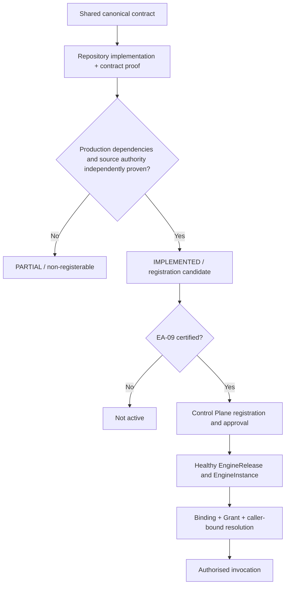

# ADR-REG-0035 — R-CAP-10 Provider Promotion, Evidence Admissibility and Production Acceptance

**Status:** Accepted — Deferred Promotion, Repository-Owned Remediation  
**Date:** 2026-10-06  
**Capability tranche:** `regulations.requirement.resolve`, `regulations.evidence.assess`, `regulations.decision.evaluate`  
**Depends on:** ADR-REG-0031/0032/0034; ADR-SHARED-017/027/028; RTD-06; RTD-10  
**Authorities:** Shared catalogue/contracts, IAM identity, Control Plane activation, independent EA-09 acceptance

## Decision

R-CAP-10 is an **evidence decision**. It may promote any individual capability to
`IMPLEMENTED` only when the *whole canonical capability*, including production
dependencies and trustworthy legal-source provenance, has independently
verifiable implementation evidence.

**The current R-CAP-10 decision is DEFER_PROMOTION.** The R-CAP-09 implementation
is substantial and CI-green, but it does not authorize an automatically
registerable provider, let alone a deployed certified service.



## Current capability-specific acceptance

| Capability | Repository runtime | Remaining evidence required | Decision |
|---|---|---|---|
| `regulations.requirement.resolve` | Exact Shared request/response, context guards, PostgreSQL append-only pinned authority and tenant RLS | Governed source-to-projection ingestion/promotion, IAM authenticator, workload allocation and Control Plane invocation proof | **PARTIAL** |
| `regulations.evidence.assess` | Contract API, durable assessment/idempotency, transactionally recorded canonical outbox | Same requirement/identity authority, grant-bound invocation, deployed publisher/broker acknowledgement | **PARTIAL** |
| `regulations.decision.evaluate` | Bitemporal verified BRIR authority, deterministic Rego compiler, live OPA, durable replay and RLS | Legal-source assurance, signed production bundle/trust root and verified deployment, IAM resource-server authority, invocation proof | **PARTIAL** |

This ADR does not confuse a test rule fixture with certified law.

## Requirement authority remediation

Migration `000006_regulatory_requirement_projections.sql` adds a durable
Regulations-owned store for exact pinned documentary/permit/evidence
requirements:

- immutable reference/content fingerprints (SHA-256 canonical JSON);
- one row per historical reference pin; no silent substitution of CURRENT;
- exact lookup, version conflict, not-found and owner unavailable separation;
- tenant-aware PostgreSQL RLS, including default denial without tenant context;
- SELECT-only runtime grants (no direct requirement mutation);
- append-only governed writer whose *caller* must supply reviewed source-backed
  projections, with identical repeat appends allowed and conflicting rewrites rejected;
- payload/reference redundancy checked on reads;
- no TradeDocument ownership, shipment/order mutation or foreign database read.

**This is a production-shaped storage adapter, not ingestion approval.** It
does not manufacture source rights, competent authority confirmation,
regulatory review or evidence of a populated production store. Those remain
a named independent acceptance gate.

## Evidence admissibility

The local `.baobab/r-cap-10-readiness.yaml` is a **deferred-readiness
register** and cannot self-certify or activate a provider.

Accepted local evidence:
- source, tests and exact Shared contract compatibility;
- PostgreSQL migration plus real non-BYPASSRLS role tests;
- reproducible compiler/OPA policy execution and golden cases;
- source-control revision and passing CI for the exact revision.

Evidence that cannot be invented by this repository:
- IAM workload resource-server verification and authorised caller audience;
- Control Plane capability resolution, binding, grant and invocation authority;
- signed production OPA bundle delivery with trust-root verification;
- governed actual regulatory source ingestion and legal semantic assurance;
- an installed event transport and delivery acknowledgement;
- independent EA-09 certification;
- healthy registered provider and active EngineInstance.

An external gate state cannot be marked VERIFIED by editing a local YAML
file. Promotion needs a future trusted attestation verifier or direct,
authorised, bounded integration with the relevant authority, with immutable
evidence IDs and results. The R-CAP-10 local validator explicitly rejects
self-attestation rather than treating a URL or SHA string as a certificate.

## Implementation and activation must remain separate

```text
PARTIAL -> IMPLEMENTED
    repository-owner promotion, full canonical capability proof

IMPLEMENTED -> EA-09 certification
    independent certification authority

CERTIFIED -> ACTIVE + bound + granted
    Control Plane + IAM + deployment authorities
```

`production_permitted: true` in a provider family says only that production
promotion is not categorically forbidden; it is not a readiness verdict.
The Shared registration generator remains blocked for all-PARTIAL providers.
No invocation URL/topology, signing secrets, validator audience grant or CP
capability grant may be invented merely to satisfy a local test.

## CI exit condition

R-CAP-10 can conclude its **repository-owned increment** when CI proves:

1. migration 000006 applies in PostgreSQL 17;
2. historical pins coexist, an unknown pin yields conflict versus not-found as appropriate;
3. duplicate identical append is idempotent, mutation of an existing pin fails;
4. runtime with no tenant binding sees no tenant rows, cannot INSERT;
5. wrong-tenant read cannot reveal a tenant requirement;
6. row content/identity tampering is a technical integrity failure;
7. provider maturity stays PARTIAL for all three capability majors;
8. the readiness register includes every independent promotion and activation gate;
9. removing gates, forging evidence or manually setting IMPLEMENTED fails CI;
10. RTD-10 and inherited R-CAP-07/08/09 conformance remains green.

This does **not** mean that R-CAP-10 provider promotion has been approved.
The open external gates are an explicit release blocker, not an implementation
error to hide.

## Next acceptance work outside this repository-only increment

The separately owned IAM, Shared, Control Plane and infrastructure work must
supply governed workload identity/audience allocation, exact capability
invocation permission, cryptographically verified bundle distribution, event
transport and deployment evidence. Regulations must provide reviewed real
rule/requirement publishing and independent regulatory golden-case assurance.
Only then should the owner request independent EA-09 certification, promote
each proven support entry individually, and submit registration for Control
Plane lifecycle/activation.

**Decision:** Preserve `PARTIAL`; deliver the append-only requirement
authority and enforceable evidence gate now; never report production activation
until the independent authorities agree.
