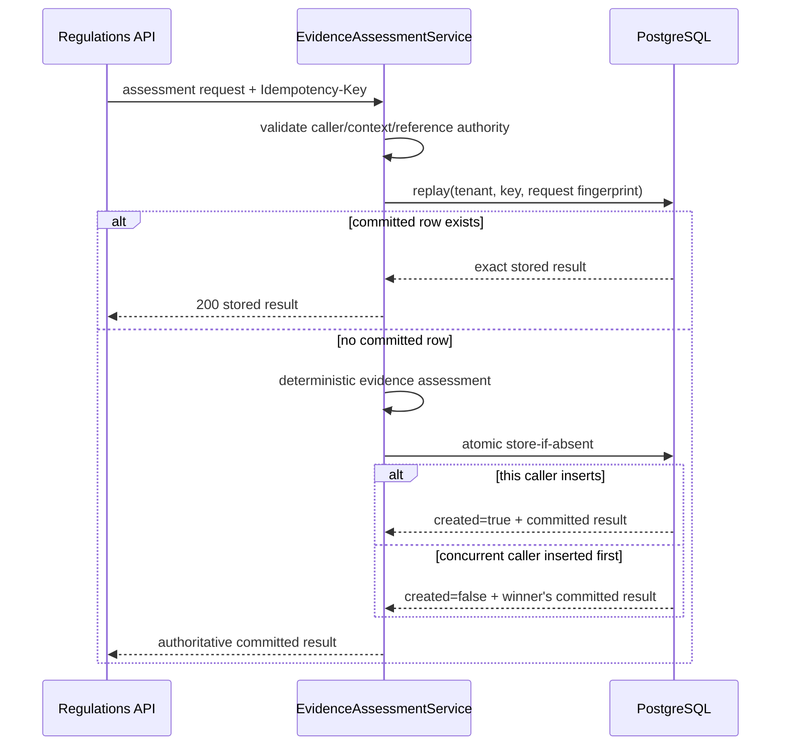

# R-CAP-05 durable evidence assessments

R-CAP-05 makes `regulations.evidence.assess` durable without changing the
canonical RTD-06 wire contract or moving operational ownership into
Regulations.

## Persistence boundary

`regulatory_evidence_assessments` stores one immutable assessment record for
each:

```text
trusted tenant
+
Idempotency-Key
```

The record retains:

| Field | Purpose |
|---|---|
| `assessment_id` | Regulations-owned assessment identity |
| `tenant_id` | Trusted Control Plane tenant scope |
| `idempotency_key` | Command replay identity within the tenant |
| `request_fingerprint` | SHA-256 of canonical RTD-06 request JSON |
| `result_fingerprint` | SHA-256 of canonical RTD-06 result JSON |
| `request_payload` | Historical request/evidence snapshot |
| `result_payload` | Historical assessment returned on replay |
| requirement / decision IDs | Query and audit indexes |
| outcome / evaluated_at | Durable assessment projection |

The full request snapshot is deliberate. An idempotent replay must not fetch a
current Trade Docs document, current verification state, or another mutable
projection and accidentally turn replay into reassessment.

## Command flow



## Concurrency invariant

Two simultaneous requests with the same tenant, key and request fingerprint may
evaluate at slightly different wall-clock instants before persistence.

They must still converge on one durable result:

```text
candidate A
candidate B
    │
    └──── atomic INSERT ... ON CONFLICT DO NOTHING
                         │
                         ▼
                one committed row
                         │
               ┌─────────┴─────────┐
               ▼                   ▼
          caller A returns    caller B returns
            same row             same row
```

The service therefore treats the result returned by the durable commit as
authoritative rather than blindly returning its local candidate.

A reused key with a different request fingerprint is a conflict and never
overwrites the original assessment.

## Tenant isolation

The assessment row is tenant-confidential evidence state.

R-CAP-05 uses both:

```text
explicit WHERE tenant_id = ...
+
PostgreSQL RLS
```

The migration enables and forces row-level security. The application adapter
sets:

```text
baobab.tenant_id
```

with transaction-local scope using `set_config(..., true)`.

Consequences:

- no tenant context => no tenant rows;
- tenant A cannot read tenant B;
- tenant A cannot insert tenant B;
- the setting is automatically cleared at transaction completion;
- pooled connections cannot retain the previous request's tenant context.

Production must still use a non-owner, non-superuser runtime role without
`BYPASSRLS`, with schema ownership/migrations held by a separate identity as
required by ADR-REG-0028.

## Append-oriented history

The application runtime is granted only `SELECT` and `INSERT` in the R-CAP-05
integration model. It does not update an assessment after commitment.

Corrections, changed evidence and regulatory reassessment create new commands
and new assessment identities. Historical assessment results remain available
for replay and future event/audit processing.

## Crash behavior

| Failure point | Retry behavior |
|---|---|
| before durable insert | retry may re-evaluate; no committed history exists yet |
| after insert commits but before HTTP response | retry finds the committed row and returns it |
| simultaneous duplicate | one insert wins; all callers return the committed winner |
| same key, changed request | 409 conflict through the application service |
| database unavailable | retryable 503 through the existing R-CAP-02/04 error mapping |
| stored JSON/fingerprint mismatch | integrity failure; never silently recomputed |

## Relationship to R-CAP-06

R-CAP-05 intentionally does not publish the RTD-08 event.

R-CAP-06 must add the canonical outbox in the **same database transaction** as
the durable assessment commit so this state cannot occur:

```text
assessment committed
+
process crashes
+
event permanently lost
```

Until that transactional outbox is present, provider support remains
undeclared.
