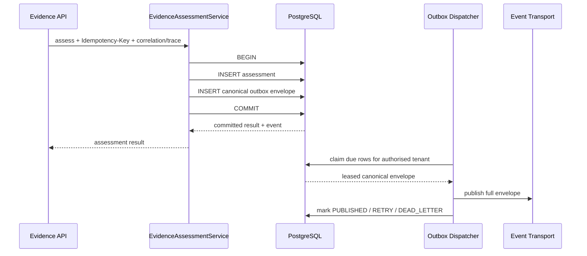

# R-CAP-06 canonical event outbox publication

R-CAP-06 makes the committed result of `regulations.evidence.assess` a durable
canonical RTD-08 event occurrence without introducing an unsafe dual write.

## Canonical event

The emitted event is exactly:

```text
com.baobab-platform.regulations.requirement-satisfaction.evaluated.v1
```

Shared remains the authority for:

- the canonical CloudEvents-compatible envelope;
- the payload schema;
- the event type;
- the Regulations producer authority.

The logical producer is always:

```text
urn:baobab-platform:service:baobab-regulations
```

The event subject is:

```text
regulatory-evidence-assessment:<assessment_id>
```

The event `time` is the assessment's `evaluated_at` business occurrence,
not the relay's publication time.

## Transactional boundary

The assessment row and event intent are one local PostgreSQL transaction:



This state is forbidden:

```text
assessment committed
+
no durable event intent
```

If the outbox insert fails, the assessment insert rolls back with it.

## Idempotency and occurrence identity

The HTTP command remains tenant-scoped by:

```text
tenant_id + Idempotency-Key
```

The canonical event occurrence ID is stable for the Regulations-owned
assessment identity.

Therefore:

```text
same committed assessment
        ↓
same CloudEvent id
        ↓
same (source, id) consumer deduplication key
```

A delivery retry never creates a new event occurrence.

A simultaneous duplicate assessment command may produce two in-process
candidates, but only the winner's assessment **and** event envelope commit.
Every caller receives the winner's durable result and event identity.

## Correlation and trace propagation

R-CAP-06 preserves request metadata at commit time:

```text
X-Correlation-ID
    ↓
correlationid

traceparent
    ↓
traceparent
```

The dispatcher does not generate replacement correlation or trace metadata.

`causationid` remains optional. The current HTTP command has an
`Idempotency-Key`, not a canonical UUID command occurrence, so R-CAP-06 does
not fabricate a causation UUID.

## Tenant isolation

Both the assessment table and outbox use:

```text
explicit tenant predicates
+
transaction-local baobab.tenant_id
+
ENABLE ROW LEVEL SECURITY
+
FORCE ROW LEVEL SECURITY
```

The dispatcher is intentionally tenant-scoped:

```text
dispatch_due(tenant_id=trusted_tenant)
```

There is no:

```text
tenant = "*"
system tenant
global unscoped outbox scan
```

A deployment scheduler may enumerate authorised tenant work through governed
platform mechanisms, but the repository itself never bypasses tenant isolation
to make dispatch convenient.

## Delivery semantics

Delivery is **at least once**.

Outbox states are:

```text
PENDING
  ↓ claim
PUBLISHING
  ├── success ──> PUBLISHED
  ├── failure ──> RETRY
  └── attempts exhausted ──> DEAD_LETTER
```

A claim carries a lease.

If a process:

1. publishes the event;
2. crashes before recording `PUBLISHED`;

the expired `PUBLISHING` lease becomes claimable again and the exact original
event ID is redelivered.

Consumers therefore deduplicate with:

```text
(source, id)
```

as required by Shared RTD-08.

## Claim concurrency

PostgreSQL claim uses:

```sql
FOR UPDATE SKIP LOCKED
```

and updates the lease in the same transaction.

Multiple relay workers can therefore process one tenant's queue without
serialising the whole outbox or publishing the same actively leased row
concurrently.

## Immutable event content

The runtime role may update delivery-state columns only.

It must not rewrite:

- `event_id`;
- `event_type`;
- `source`;
- `subject`;
- `tenant_id`;
- `correlation_id`;
- `idempotency_key`;
- `envelope`;
- `envelope_fingerprint`.

The database also checks that redundant identity columns equal the values inside
the JSON envelope.

Before publication, the repository recomputes the SHA-256 envelope fingerprint
and validates the canonical RTD-08 event model.

## Retry policy

The default dispatcher policy is:

| Control | Default |
|---|---:|
| maximum attempts | 8 |
| initial retry delay | 1 second |
| maximum retry delay | 300 seconds |
| publish lease | 60 seconds |
| maximum batch | 500 |

Retry uses bounded exponential backoff.

Error persistence stores a short error **code**, not arbitrary exception text,
to reduce the risk of secrets or payload data leaking into operational state.

## Why `document-requirements.determined` is not emitted here

RTD-08 also activates:

```text
com.baobab-platform.regulations.document-requirements.determined.v1
```

R-CAP-06 does not emit it from:

```text
POST /documentary-requirements/resolve
```

because that route performs an exact lookup of an already-established
requirement.

Publishing a “requirements determined” event on a read would incorrectly turn:

```text
read existing fact
```

into:

```text
new determination occurred
```

The event should be wired when Regulations implements the authoritative
requirement-set determination write path.

## Migration safety

R-CAP-06 was introduced before provider activation. On first creation of the
outbox table, migration `000004` therefore refuses to proceed if unexplained
assessment rows already exist.

That is deliberate.

Such rows would require an explicit historical event/backfill decision because
their original correlation metadata cannot safely be invented after the fact.

## Transport boundary

The dispatcher depends on:

```text
CanonicalEventPublisherPort
```

The port receives the **complete canonical envelope**.

Kafka, Redis, NATS, EventBridge, or another transport may be wired by deployment
configuration without changing the Regulations domain or canonical event
contract.

R-CAP-06 does not pretend that a specific broker has been deployed where no such
infrastructure evidence exists.

## Provider-readiness consequence

R-CAP-06 closes the local durable event-intent gap for
`regulations.evidence.assess`.

It does not by itself justify provider activation.

Still separate are:

- production workload authentication;
- Shared/IAM `baobab-regulations` validator-workload allocation for
  `context:validate`;
- deployment transport wiring;
- R-CAP-07 provider-support decision/certification evidence.
